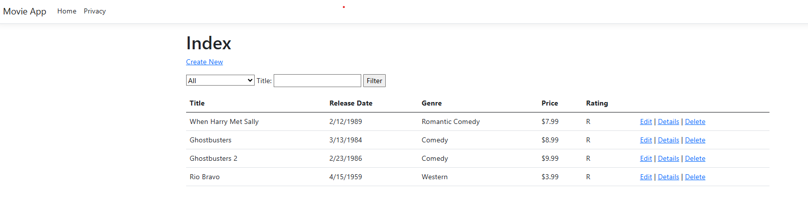
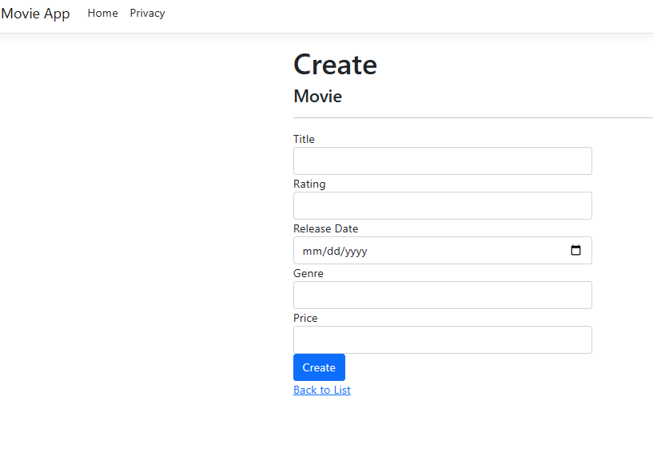
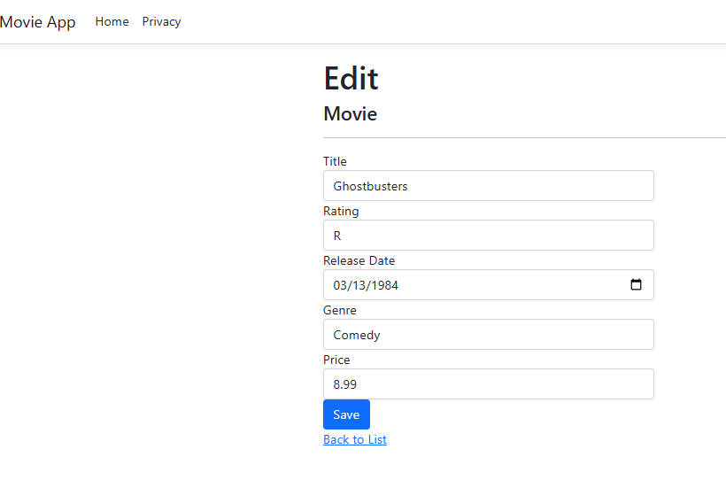

# MvcMovies - ASP.NET Core MVC App (.NET 8.0)

A Movie Management Web Application built using C# and **ASP.NET Core MVC (.NET 8.0)**. This project follows the official Microsoft ASP.NET Core MVC tutorial to demonstrate full CRUD (Create, Read, Update, Delete) functionality, Entity Framework Core integration, and search capabilities.

## 🚀 Features

* **MVC Architecture:** Built using the Model-View-Controller design pattern.
* **CRUD Operations:** Users can create new movies, edit existing details, view details, and delete movies.
* **Search & Filtering:** Filter the movie list by Title or Genre.
* **Database Integration:** Uses Entity Framework Core (EF Core) for data management (SQL Server LocalDB).
* **Validation:** Implementation of server-side and client-side validation logic.
* **Styling:** Responsive UI using Bootstrap.

## 🛠️ Technologies Used

* **Framework:** .NET 8.0
* **Language:** C#
* **Web Framework:** ASP.NET Core MVC
* **ORM:** Entity Framework Core
* **IDE:** Visual Studio 2022

## 📸 Screenshots

Here is a look at the application in action:

### 1. Movie Index & Search
The main dashboard where users can view all movies, filter by genre, and search by title.


### 2. Create New Movie
A form to add new movies to the database with validation fields for Rating, Release Date, and Price.


### 3. Edit Movie
Functionality to update existing movie records.


## 💻 Getting Started

To run this project locally, follow these steps:

1.  **Clone the repository:**
    ```bash
    git clone https://github.com/marius2347/MvcMovies-using-DOTNET8.0-in-CSharp.git
    ```
2.  **Open the project:**
    Open the solution file (`.sln`) in **Visual Studio 2022**.
3.  **Restore Dependencies:**
    Visual Studio should automatically restore the NuGet packages. If not, run:
    ```bash
    dotnet restore
    ```
4.  **Update Database:**
    Open the **Package Manager Console** (Tools > NuGet Package Manager > Package Manager Console) and run:
    ```powershell
    Update-Database
    ```
5.  **Run the Application:**
    Press **F5** or click the **Run** button (https) in Visual Studio to start the server.

## 📬 Contact

If you have any questions or suggestions regarding this project, feel free to reach out:

* **Email:** [mariusc0023@gmail.com](mailto:mariusc0023@gmail.com)
